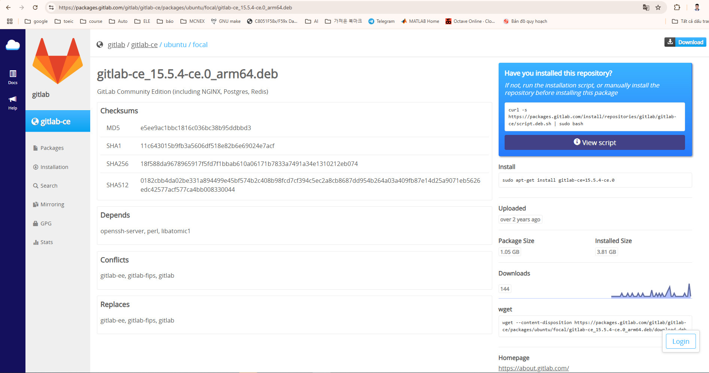
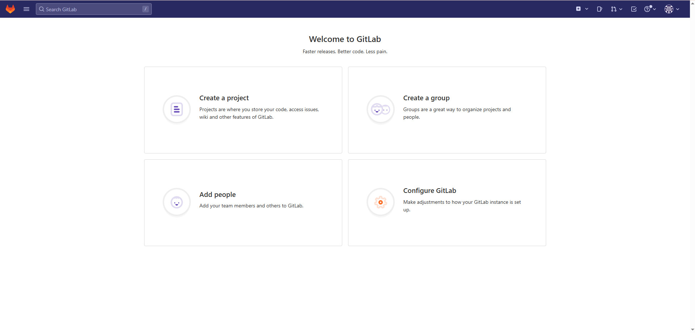

# Cách cài đặt gitlab server trên ubuntu 20.04

## 1. Chọn phiên bản gitlab server phù hợp

- Truy cập đường link https://packages.gitlab.com/gitlab/gitlab-ce (tùy theo mục đích cài có thể chọn bản ee (Enterprise Edition) hoặc ce (Community Edition))
- Hướng dẫn này đang cài ubuntu 20.04 nên sẽ chọn bản ubuntu/focal 15.5.4
https://packages.gitlab.com/gitlab/gitlab-ce/packages/ubuntu/focal/gitlab-ce_15.5.4-ce.0_arm64.deb

## 2. Tải các gói cài đặt về máy
> **`curl -s https://packages.gitlab.com/install/repositories/gitlab/gitlab-ce/script.deb.sh | sudo bash`**
- Nếu báo chưa cài curl thì dùng lệnh 
> **apt install curl**
## 3. Cài đặt gitlab server
> **sudo apt-get install gitlab-ce=15.5.4-ce.0** 
## 4. Cấu hình domain cho server
- Mở file gitlab.rb
>**nano /etc/gitlab/gitlab.rb**

và sửa dòng http://gitlab.example.com (mặc định) thành tên domain mong muốn ví dụ http://gitlab.myserver.com hoặc dùng chính ip của máy server đang cài ví dụ http://192.168.1.100 lưu file và thoát.
## 5. Cấu hình Gitlab
- Sau khi cài đặt, chạy lệnh để khởi tạo và cấu hình GitLab:
> **sudo gitlab-ctl reconfigure**
## 6. Truy cập Gitlab
- Mở trình duyệt trên máy trong cùng mạng LAN.
- Truy cập: http://192.168.1.100
- Đăng nhập và đặt lại mật khẩu cho tài khoản root. (Mật khẩu mặc đinh được lấy trong file initial_root_password)
> cat /etc/gitlab/initial_root_password

> [!NOTE]
>  Nếu ở bước 4 bạn dùng tên miền nội bộ (http://gitlab.myserver.com), bạn cần chỉnh lại external_url, thêm domain đó vào file hosts, và cấu hình DNS hoặc /etc/hosts trên các máy client.

❗ Nếu bạn không truy cập được:
- Gõ lệnh sau để kiểm tra các dịch vụ GitLab đã chạy chưa:
> **sudo gitlab-ctl status**
- Kiểm tra cổng 80 có bị chặn hoặc đang được dùng bởi dịch vụ khác không:
> **sudo netstat -tuln | grep :80**

(thường thì nếu bạn cài Apache. Apache2 chạy cổng 80, và nó chiếm quyền xử lý các yêu cầu HTTP, thay vì để GitLab (nginx của GitLab) xử lý)
- Có 2 cách xử lý 1 là Tắt hoặc gỡ Apache2. 2 là chuyển Gitlab sang port khác 
🔧 Cách chuyển GitLab sang port 83:
📝 Bước 1: Sửa file cấu hình GitLab
Mở file /etc/gitlab/gitlab.rb:
> sudo nano /etc/gitlab/gitlab.rb

sửa external_url http://gitlab.myserver.com thành http://gitlab.myserver.com:83 (hương dẫn này sử dụng port 83 thay cho 80) sau đó thực hiện lại từ bước 5.

