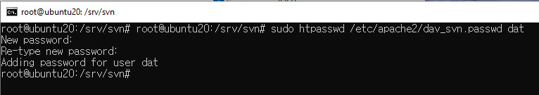
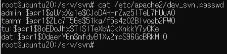
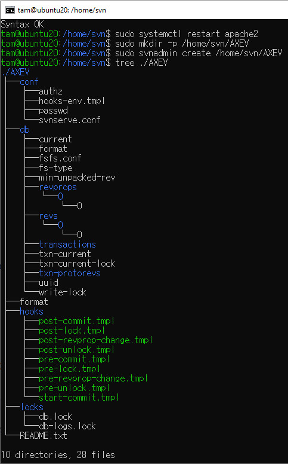

# Cách cài đặt SVN server trên ubuntu 20.04

## 1.SVN Server yêu cầu máy chủ web Apache, có thể cài đặt bằng cách chạy lệnh:

> sudo apt update
> sudo apt -y install apache2 apache2-utils

## 2. Sau đó cài đặt Apache SVN:

> sudo apt -y install nano tree subversion libsvn-dev libapache2-mod-svn subversion-tools

## 3. Kích hoạt các mô-đun Apache theo yêu cầu của SVN:

> sudo a2enmod dav dav_svn
> sudo systemctl restart apache2

Chỉnh sửa tệp cấu hình SVN Apache và thực hiện các thay đổi tương tự như bên dưới:

> sudo nano /etc/apache2/mods-enabled/dav_svn.conf

- Thêm nội dung sau vào cuối file:

<Location /svn>
   DAV svn
   SVNParentPath /home/svn
   AuthType Basic
   AuthName "SVN Repository"
   AuthUserFile /etc/apache2/dav_svn.passwd
   Require valid-user
</Location>

## 4. Kiểm tra cú pháp cấu hình

> sudo apachectl -t
Syntax OK

- Sau đó khởi động lại dịch vụ apache2:

> sudo systemctl restart apache2

# Tạo người dùng SVN

Chúng tôi đã chỉ định trong tệp cấu hình SVN Apache rằng thông tin xác thực người dùng sẽ được lưu trên /etc/apache2/dav_svn.passwd.

 ## 1. Tạo người dùng Subversion quản trị viên của chúng tôi.
 
 > sudo htpasswd -cm /etc/apache2/dav_svn.passwd admin
 
- Cung cấp mật khẩu người dùng quản trị viên của bạn:

New password: <ENTER PASSWORD>
Re-type new password:<CONFIRM PASSWORD>
Adding password for user admin

## 2. Tùy chọn đã sử dụng:

-c : Create a new file.
-m Force MD5 encryption of the password (default).
Khi thêm người dùng khác, không sử dụng tùy chọn -c  mà chỉ cần chuyển -m để sửa đổi tệp.

> sudo htpasswd -m /etc/apache2/dav_svn.passwd user1
> sudo htpasswd -m /etc/apache2/dav_svn.passwd user2
> sudo htpasswd -m /etc/apache2/dav_svn.passwd user1

Kiểm tra list user đang tồn tại

> cat /etc/apache2/dav_svn.passwd

# Tạo kho lưu trữ SVN

## 1. Tạo kho lưu trữ bằng lệnh svnadmin công cụ quản trị kho lưu trữ Subversion.

> sudo mkdir -p /home/svn/<repo-name>
> sudo svnadmin create /home/svn/<repo-name>

- Đặt chủ sở hữu của thư mục /home/svn thành người dùng và nhóm www-data.

> sudo  chown -R www-data:www-data  /home/svn
> sudo chmod -R 775 /home/svn

