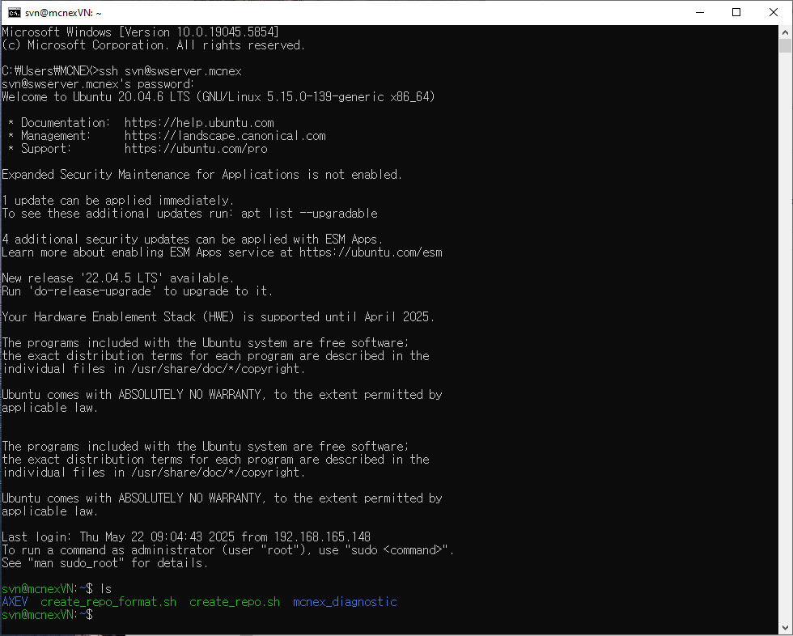
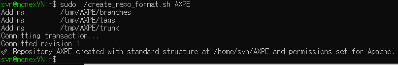
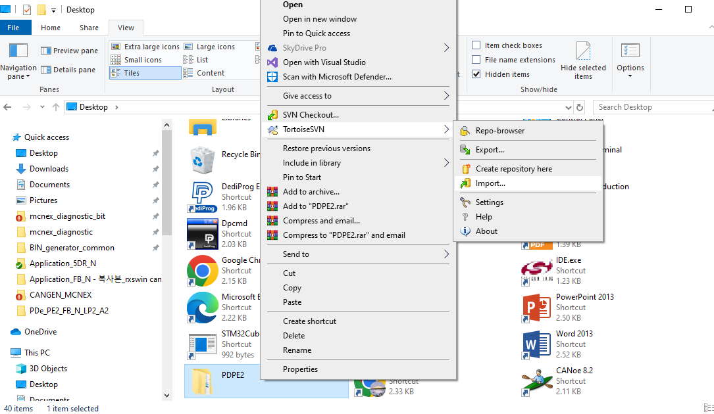
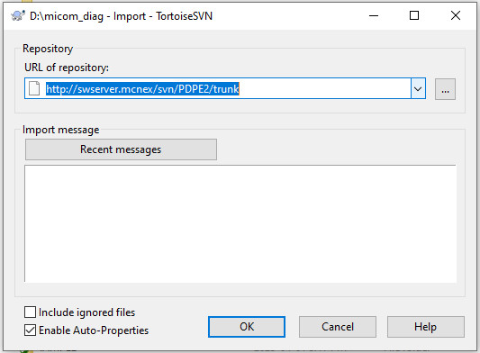
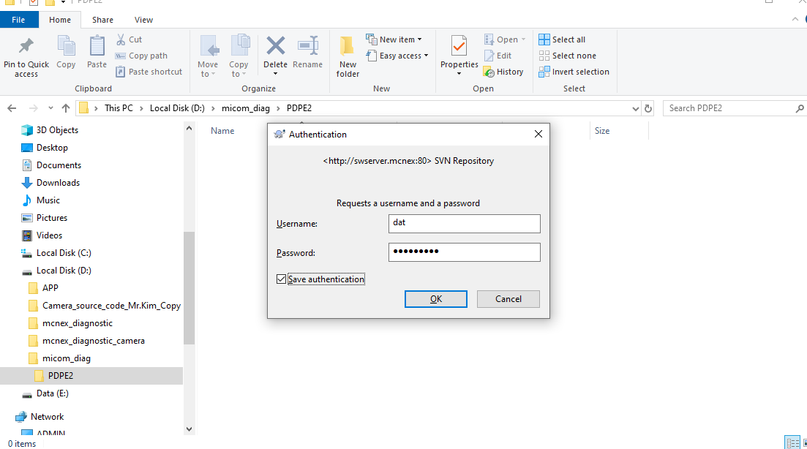
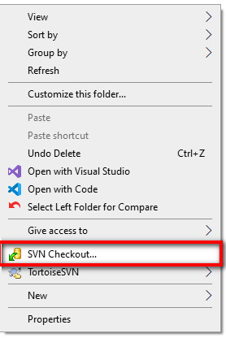
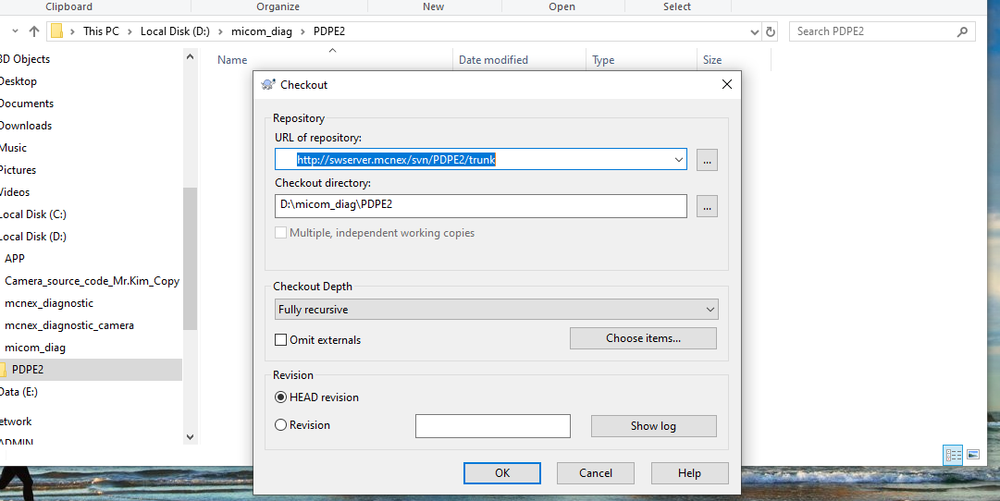
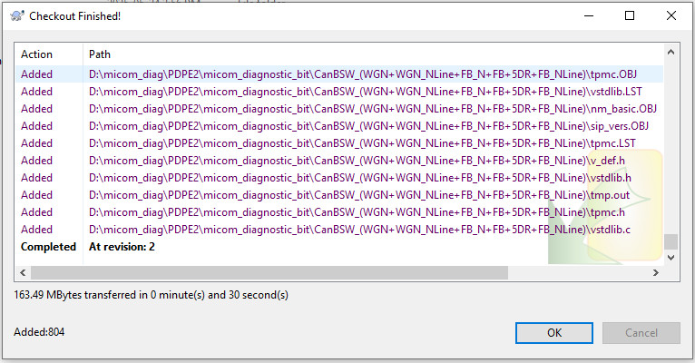

# Tạo repo trên server và import code từ SVN windows đến server

## 1.Tạo repo trên server

- Truy cập server từ windows bằng phương thức SSH

- Xem toàn bộ các repo hiện có bằng lệnh:

> ls



- Có 2 file tạo tự động repo:

Tạo repo theo format dưới đây sử dụng file create_repo_svn.sh

```
<repo-name>
├── branches
├── tags
└── trunk
```

> sudo ./create_repo_format.sh repo-name



Nếu sử dụng file create_repo.sh sẽ chỉ tạo ra repo với duy nhất thư mục repo-name

## 2. Import file từ thư mục trên windows vào thư mục trunk trên server

Tìm thư mục chứa nội dung muốn import --> Click chuột phải --> Chọn TortoiseSVN --> Import



Điền đường dẫn tới repo vừa tạo thường là định là: http://swserver.mcnex/svn/repo-name/trunk

Điền nội dung Import message --> Nhấn OK



Nếu chưa đăng nhập SVN sẽ yêu cầu nhập vào tài khoản và mật khẩu lần đầu như hình bên dưới:



## 3. Checkout repo vừa tạo trên server về máy tính sử dụng SVN windows

Mở thư mục sẽ chứa repo sau khi checkout --> Click chuột phải --> SVN Checkout



Điền đường dẫn tới repo mặc định là: http://swserver.mcnex/svn/repo-name/trunk



Checkout thành công:

